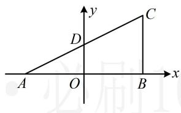

> [!faq]- 《第1节 直线的方程》参考答案
>
> > [!success]- **【答案】** B
>
> > [!note]- **【分析】**
> > 本题未单列分析。
>
> > [!note]- **【解析】**
> > B
> >
> > 解析：只要找到外心、重心、垂心中的任意两个，就能求出欧拉线，再由欧拉线与 $l$ 平行求 $a$ ，我们画图来看哪两个心好找，如图， $\triangle ABC$ 为直角三角形，所以其外心为斜边中点 $D\left(0, \frac{3}{2}\right)$ ，垂心为直角顶点 $B(3,0)$ ，
> >
> > 所以欧拉线的斜率 $k = \frac{\frac{3}{2} - 0}{0 - 3} = -\frac{1}{2}$ ，其方程为 $y = -\frac{1}{2} x + \frac{3}{2}$ ，
> >
> > 欧拉线斜率存在，则 $l$ 的斜率也存在，可先用斜率相等求参，再检验是否重合，
> >
> > $$
> > a x + (a ^ {2} - 3) y - 9 = 0 \Rightarrow y = - \frac {a}{a ^ {2} - 3} x + \frac {9}{a ^ {2} - 3},
> > $$
> >
> > 所以 $-\frac{a}{a^2 - 3} = -\frac{1}{2}$ ，解得： $a = -1$ 或3，
> >
> > 当 $a = 3$ 时， $l$ 的方程为 $3x + 6y - 9 = 0$ ，即 $y = -\frac{1}{2} x + \frac{3}{2}$ ，与欧拉线重合，舍去，故 $a = -1$ 。
> >
> > 
