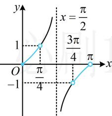

> [!faq]- 《第1节 直线的方程》参考答案
>
> > [!success]- **【答案】** A
>
> > [!note]- **【分析】**
> > 本题未单列分析。
>
> > [!note]- **【解析】**
> > A
> >
> > 解析：要求倾斜角的范围，先求斜率的范围， $(\sin\alpha)x-y+3\sqrt{2}=0\Rightarrow y=(\sin\alpha)x+3\sqrt{2}$ 所以直线 l 的斜率 $k = \sin \alpha$ ，
> > 因为 $\alpha \in \left(-\frac{\pi}{2}, \frac{\pi}{2}\right)$ ，所以 $-1 < \sin \alpha < 1$ ，故 $k \in (-1, 1)$ ，
> > 斜率有正有负，则倾斜角有锐有钝，故分两段考虑，
> > 如图，当 $k \in (-1, 0)$ 时，倾斜角的取值范围是 $\left(\frac{3\pi}{4}, \pi\right)$ ;
> > 当 $k \in [0,1)$ 时，倾斜角的取值范围是 $\left[0, \frac{\pi}{4}\right)$ ;
> > 综上所述，直线 l 的倾斜角的取值范围是 $\left[0, \frac{\pi}{4}\right) \cup \left(\frac{3\pi}{4}, \pi\right)$ .
> >
> > 
