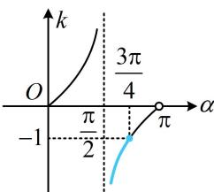

> [!faq]- 《第1节 直线的方程》例题解析
>
> > [!success]- **【答案】** A
>
> > [!note]- **【分析】**
> > 本题未单列分析。
>
> > [!note]- **【解析】**
> > A. $\left[\frac{\pi}{2}, \frac{3\pi}{4}\right]$ B. $\left(\frac{\pi}{2}, \frac{3\pi}{4}\right]$ C. $\left[\frac{\pi}{2}, \pi\right)$ D. $\left[\frac{3\pi}{4}, \pi\right)$
> >
> > 解析：已知两点坐标，可求出斜率的范围，再求倾斜角的范围，先考虑斜率不存在的情形，当 $x = 0$ 时， $A(0, -2)$ ， $B(0, 0)$ ， $l \perp x$ 轴，所以直线 $l$ 的倾斜角 $\alpha = \frac{\pi}{2}$ ；
> >
> > 当 $x > 0$ 时， $l$ 不与 $x$ 轴垂直，其斜率 $k = \frac{-2 - x^2}{2\sqrt{2}x - 0} = -\frac{2 + x^2}{2\sqrt{2}x} = -\frac{\sqrt{2}}{4}\left(\frac{2}{x} + x\right) \leq -\frac{\sqrt{2}}{4} \times 2\sqrt{\frac{2}{x} \cdot x} = -1$
> >
> > 当且仅当 $\frac{2}{x} = x$ ，即 $x = \sqrt{2}$ 时取等号，所以 $k = \tan \alpha \in (-\infty, -1]$
> >
> > 如图，由图可知 $\alpha \in \left(\frac{\pi}{2},\frac{3\pi}{4}\right]$
> >
> > 综上所述， $\alpha$ 的取值范围是 $\left[\frac{\pi}{2},\frac{3\pi}{4}\right]$
> >
> >
> > 
