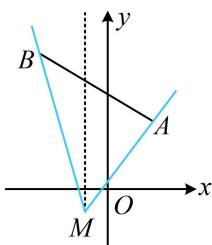

> [!faq]- 《第1节 直线的方程》例题解析
>
> > [!success]- **【答案】** A
>
> > [!note]- **【分析】**
> > 本题未单列分析。
>
> > [!note]- **【解析】**
> > 解析：要求斜率的范围，不妨先画图分析直线 $l$ 的变动范围，找到临界状态，如图，直线 $l$ 从 $MA$ 绕点 $M$ 逆时针旋转至 $MB$ ，与线段 $AB$ 有交点，
> >
> > 两个临界状态的斜率分别为 $k_{MA} = \frac{-1 - 3}{-1 - 2} = \frac{4}{3}$ ， $k_{MB} = \frac{-1 - 6}{-1 - (-3)} = -\frac{7}{2}$
> >
> > 最后分析范围应取两者之间，还是两者之外，可分两部分考虑，
> >
> > 当直线 $l$ 从 $MA$ 旋转到图中虚线时，斜率 $k$ 从 $\frac{4}{3}$ 变到 $+\infty$ ；
> >
> > 当直线从虚线继续旋转到 $MB$ 时，斜率从 $-\infty$ 变到 $-\frac{7}{2}$ ；故 $k \in \left(-\infty, -\frac{7}{2}\right] \cup \left[\frac{4}{3}, +\infty\right)$ .
> >
> > 
>
> > [!tip]- **【反思】**
> > - **①**：若题目与 $l$ 有关的条件改为 $l$ 的方程为 $x - my + 1 - m = 0$ ，还会做吗？根据内容提要第4点，直线 $l$ 隐藏了过定点 $(-1, -1)$ 这一条件，接下来的过程和本题相同；
> > - **②**：当直线 $l$ 从 $l_{1}$ 绕定点旋转到 $l_{2}$ 时，若旋转过程中经过了竖直线，则斜率的变化范围取两者之外；若没有经过竖直线，则取两者之间。
