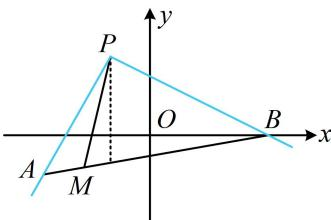

> [!faq]- 《第1节 直线的方程》例题解析
>
> > [!success]- **【答案】** A
>
> > [!note]- **【分析】**
> > 本题未单列分析。
>
> > [!note]- **【解析】**
> > 解析：出现关于 $x, y$ 的一次分式结构，可考虑用两点连线的斜率来分析，
> >
> > 因为 $\frac{y - 2}{x + 1} = \frac{y - 2}{x - (-1)}$ ，所以 $\frac{y - 2}{x + 1}$ 可以看成动点 $M(x,y)$ 与定点 $P(-1,2)$ 的连线斜率，
> >
> > 如图，当 $M$ 从 $A$ 运动到 $B$ ，直线 $PM$ 就从 $PA$ 绕点 $P$ 逆时针旋转至 $PB$ 由题意， $k_{PA} = \frac{-1 - 2}{-1 - \sqrt{3} - (-1)} = \sqrt{3}$ ， $k_{PB} = \frac{2 - 0}{-1 - 3} = -\frac{1}{2}$ ，因为旋转过程中经过了竖直线，所以斜率的变化范围是 $\left(-\infty, -\frac{1}{2}\right] \cup [\sqrt{3}, +\infty)$ .
> >
> > 
>
> > [!tip]- **【反思】**
> > 根据两点连线的斜率公式 $k = \frac{y_2 - y_1}{x_2 - x_1}$ 所展现的形式，解析几何中涉及关于 $x, y$ 的一次分式结构，都可以尝试运用斜率的几何意义来分析问题.
