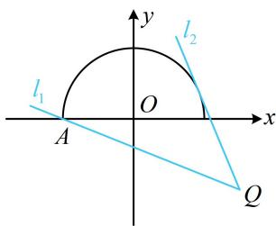

> [!faq]- 《第1节 直线的方程》例题解析
>
> > [!success]- **【答案】** $\left[-\frac{7}{5},\frac{3}{5}\right]$
>
> > [!note]- **【分析】**
> > 本题未单列分析。
>
> > [!note]- **【解析】**
> > 解析：出现关于 $x, y$ 的一次分式结构，考虑运用斜率来分析，要凑出斜率，得先把分子的 $x$ 拆掉，因为 $\frac{x + y - 1}{x - 3} = \frac{(x - 3) + y + 2}{x - 3} = 1 + \frac{y + 2}{x - 3}$ ，记 $t = \frac{y + 2}{x - 3}$ ，则 $\frac{x + y - 1}{x - 3} = 1 + t$
> >
> > 关键是求 t 的范围， $t=\frac{y-(-2)}{x-3}$ ，它表示动点 $P(x,y)$ 和定点 $Q(3,-2)$ 连线的斜率，故可考虑画图分析，因为 $x^{2}+y^{2}=4(y\geq0)$ ，所以点 P 在如图所示的半圆上运动，直线 PQ 的临界状态为图中的 $l_{1}$ 和 $l_{2}$ ，其中直线 $l_{1}$ 过点 $A(-2,0)$ 和点 Q，其斜率为 $\frac{-2-0}{3-(-2)}=-\frac{2}{5}$ ，
> >
> > 直线 $l_{2}$ 与半圆相切，设其斜率为 $k$ ，则其方程为 $y - (-2) = k(x - 3)$ ，即 $kx - y - 3k - 2 = 0$ 所以圆心 $O$ 到 $l_{2}$ 的距离 $d = \frac{|-3k - 2|}{\sqrt{k^2 + 1}} = 2$
> >
> > 解得： $k = -\frac{12}{5}$ 或 0（舍去，图中 $l_{2}$ 的斜率显然为负），
> >
> > 当 $P$ 在半圆上运动时，直线 $PQ$ 的扫动范围是从 $l_{2}$ 绕点 $Q$ 逆时针旋转至 $l_{1}$ ，过程中不经过竖直线，
> >
> > 故其斜率 $t$ 的变化范围是 $\left[-\frac{12}{5}, -\frac{2}{5}\right]$ ，所以 $\frac{x + y - 1}{x - 3} = 1 + t \in \left[-\frac{7}{5}, \frac{3}{5}\right]$ .
> >
> > 
