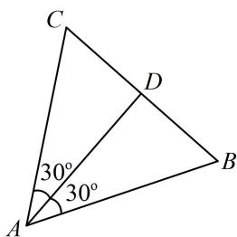

> [!faq]- 《第1节 直线的方程》例题解析
>
> > [!success]- **【答案】** $\frac{\sqrt{3}}{5}$ （或 $3\sqrt{3}$ ）
>
> > [!note]- **【分析】**
> > 本题未单列分析。
>
> > [!note]- **【解析】**
> > 解析：如图，设 $AD$ 是正 $\triangle ABC$ 的内角 $A$ 的平分线，则 $AD$ 与 $AB$ 和 $AC$ 的夹角均为 $30^{\circ}$ ，
> >
> > 涉及直线与直线的夹角，考虑用直线的方向向量来计算，
> >
> > 直线 $AD$ 的斜率为 $\frac{2\sqrt{3}}{3} \Rightarrow$ 其方向向量可取 $\pmb{m} = \left(1, \frac{2\sqrt{3}}{3}\right)$ ,
> >
> > 设直线 $AB$ 的斜率为 $k$ ，则其方向向量可取 $\pmb{n} = (1, k)$ ，
> >
> > 所以 $|\cos < m, n| = \frac{|m \cdot n|}{|m| \cdot |n|} = \frac{\left|1 + \frac{2\sqrt{3}}{3}k\right|}{\frac{\sqrt{21}}{3} \cdot \sqrt{1 + k^2}} = \cos 30^\circ = \frac{\sqrt{3}}{2}$ ，解得： $k = \frac{\sqrt{3}}{5}$ 或 $3\sqrt{3}$ .
> >
> > 
>
> > [!tip]- **【反思】**
> > 涉及直线与直线的夹角问题，常考虑用直线的方向向量来处理.
