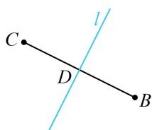

> [!faq]- 《第1节 直线的方程》例题解析
>
> > [!success]- **【答案】** $2x - y + 2 = 0$
>
> > [!note]- **【分析】**
> > 本题未单列分析。
>
> > [!note]- **【解析】**
> > 解析：如图，中垂线 $l$ 过 $BC$ 中点 $D(0,2)$ ，还差斜率，可先求 $BC$ 的斜率，再由 $l \perp BC$ 求 $l$ 的斜率，
> >
> > 由题意， $k_{BC} = \frac{3 - 1}{-2 - 2} = -\frac{1}{2}$ ，所以 $-\frac{1}{2} k_l = -1$ ，从而 $k_{l} = 2$
> >
> > 故 $l$ 的方程为 $y - 2 = 2(x - 0)$ ，即 $2x - y + 2 = 0$
> >
> >
> > 
