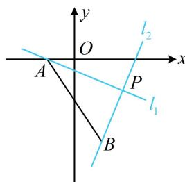

> [!faq]- 《第1节 直线的方程》例题解析
>
> > [!success]- **【答案】** 13
>
> > [!note]- **【分析】**
> > 本题未单列分析。
>
> > [!note]- **【解析】**
> > 解析：为了找到两直线所过的定点，常先把参数集中起来再看，
> >
> > 由题意，直线 $l_{1}$ 过定点 $A(-1,0)$ ， $mx + y - m + 3 = 0 \Rightarrow m(x - 1) + (y + 3) = 0$ ，所以直线 $l_{2}$ 过定点 $B(1, -3)$ ，
> >
> > 接下来若先求交点 $P$ ，再算 $\left|PA\right|^2 + \left|PB\right|^2$ ，则计算量大。而 $\left|PA\right|^2 + \left|PB\right|^2$ 的结构让我们联想到勾股定理，故来看看 $PA$ ， $PB$ 是否垂直，
> >
> > 因为两直线方程的系数满足 $A_{1}A_{2} + B_{1}B_{2} = 1\times m + (-m)\times 1 = 0$ ，所以 $l_{1}\bot l_{2}$ ，如图，故 $\left|PA\right|^2 +\left|PB\right|^2 = \left|AB\right|^2 = (-1 - 1)^2 +[0 - (-3)]^2 = 13.$
> >
> > 
>
> > [!tip]- **【反思】**
> > 当两直线都含参时，应通过分析系数来判断两直线是否隐藏了垂直、平行这些特殊的位置关系.
