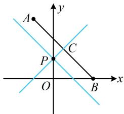

> [!faq]- 《第2节 距离公式》参考答案
>
> > [!success]- **【答案】** 详见解析
>
> > [!note]- **【分析】**
> > 本题未单列分析。
>
> > [!note]- **【解析】**
> > $y = x + 1$ 或 $y = -x + 1$
> >
> > 解法1：已知 $l$ 上一点，设斜率即可写出 $l$ 的方程，用点到直线的距离公式翻译已知条件，先考虑斜率不存在的情况，
> >
> > 当直线 $l$ 斜率不存在时，其方程为 $x = 0$ ， $A$ ， $B$ 两点到该直线的距离不相等，不合题意；
> >
> > 当直线 $l$ 斜率存在时，可设其方程为 $y = kx + 1$
> >
> > 即 $kx - y + 1 = 0$ ，由题意， $A$ ， $B$ 两点到 $l$ 的距离相等，
> >
> > 所以 $\frac{|-k - 3 + 1|}{\sqrt{k^2 + (-1)^2}} = \frac{|2k + 1|}{\sqrt{k^2 + (-1)^2}}$ ，解得： $k = 1$ 或-1，
> >
> > 故直线 l 的方程为 $y = x + 1$ 或 $y = -x + 1$ .
> >
> > 解法2：也可考虑画图看看怎样能使 $A$ ， $B$ 两点到直线 $l$ 的距离相等，如图，记 $P(0,1)$ ，要使 $A$ ， $B$ 两点到 $l$ 的距离相等，只需直线 $l$ 与 $AB$ 平行，或 $l$ 过 $AB$ 中点，
> >
> > 若 $l \parallel AB$ ，直线 $l$ 的斜率 $k = k_{AB} = \frac{3 - 0}{-1 - 2} = -1$ ，
> >
> > 所以 l 的方程为 $y = -x + 1$ ;
> >
> > 若 $l$ 过 $AB$ 中点 $C\left(\frac{1}{2}, \frac{3}{2}\right)$ ，则直线 $l$ 的斜率 $k = \frac{\frac{3}{2} - 1}{\frac{1}{2} - 0} = 1$ ，
> >
> > 所以 l 的方程为 $y = x + 1$ .
> >
> > 
