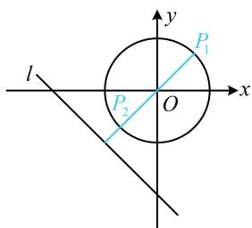

> [!faq]- 《第2节 距离公式》参考答案
>
> > [!success]- **【答案】** $[2 - \sqrt{2}, 2 + \sqrt{2}]$
>
> > [!note]- **【分析】**
> > 本题未单列分析。
>
> > [!note]- **【解析】**
> > 解析：看到 $|x + y + 2|$ ，想到点到直线的距离公式，但还缺分母部分，于是凑分母， $|x + y + 2| = \sqrt{2} \cdot \frac{|x + y + 2|}{\sqrt{1^2 + 1^2}}$ ，记 $d = \frac{|x + y + 2|}{\sqrt{1^2 + 1^2}}$ ，则 $|x + y + 2| = \sqrt{2} d$ ，其中 $d$ 表示动点 $P(x, y)$ 到定直线 $l: x + y + 2 = 0$ 的距离，先画图看看，因为 $x, y$ 满足 $x^2 + y^2 = 1$ ，所以点 $P$ 可在如图所示的单位圆上运动，由图可知， $d$ 的最大、最小值分别在 $P_1, P_2$ 处取得，圆心 $O$ 到 $l$ 的距离为 $\frac{|2|}{\sqrt{1^2 + 1^2}} = \sqrt{2}$ ，所以 $d_{\min} = \sqrt{2} - 1$ ， $d_{\max} = \sqrt{2} + 1$ ，故 $|x + y + 2| = \sqrt{2} d \in [2 - \sqrt{2}, 2 + \sqrt{2}]$ .
> >
> > 
>
> > [!tip]- **【反思】**
> > - **①**：求 $\left|Ax+By+C\right|$ 的最值，可将其凑形式，化成 $\sqrt{A^{2}+B^{2}}\cdot\frac{\left|Ax+By+C\right|}{\sqrt{A^{2}+B^{2}}}$ ，转化为点 $(x,y)$ 到直线 $Ax+By+C=0$ 的距离来分析；
> > - **②**：本题也可用三角换元来做.
