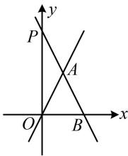
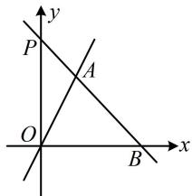
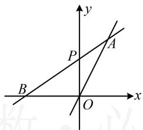
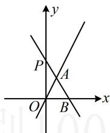

> [!faq]- 《第2节 距离公式》参考答案
>
> > [!success]- **【答案】** -2, $-\frac{4}{3}$ （答案不唯一，详见解析）
>
> > [!note]- **【分析】**
> > 本题未单列分析。
>
> > [!note]- **【解析】**
> > 解析：对于等腰三角形，需先找到谁是底，谁是腰，才能进一步翻译，故先画图分析，
> >
> > 直线 $l_{2}$ 表示绕定点 $P(0,1)$ 旋转的直线，如图，有下面几种情况都能围成等腰三角形，下面分别计算，
> >
> > 
> >
> >   
> > 图2
> >
> > 图1  
> >   
> > 图3
> >
> >   
> > 图4
> >
> > 若为图1，则 $|OA| = |AB|$ ，所以 $\angle AOB = \angle ABO$ ，从而直线 $OA, AB$ 的倾斜角互补，斜率相反，故 $k = -2$ ；若为图2，则 $|AB| = |OB|$ ，要翻译此条件，需先联立直线的方程，求 $A, B$ 的坐标，
> >
> > 联立 $\left\{ \begin{array}{l} y = kx + 1 \\ y = 0 \end{array} \right.$ 解得： $x = -\frac{1}{k}$ ，所以 $B\left(-\frac{1}{k}, 0\right)$ ，
> >
> > 联立 $\left\{ \begin{array}{l} y = kx + 1 \\ y = 2x \end{array} \right.$ 解得： $\left\{ \begin{array}{l} x = \frac{1}{2 - k} \\ y = \frac{2}{2 - k} \end{array} \right.$ ，所以 $A\left(\frac{1}{2 - k}, \frac{2}{2 - k}\right)$ ，
> >
> > 从而 $\left|AB\right|=\left|OB\right|$ 即为 $\sqrt{\left(\frac{1}{2-k}+\frac{1}{k}\right)^{2}+\left(\frac{2}{2-k}\right)^{2}}=-\frac{1}{k}$ ,
> >
> > 故 $\left(\frac{1}{2 - k} +\frac{1}{k}\right)^2 +\left(\frac{2}{2 - k}\right)^2 = \frac{1}{k^2},$
> >
> > 所以 $\frac{1}{(2 - k)^2} +\frac{2}{(2 - k)k} +\frac{1}{k^2} +\frac{4}{(2 - k)^2} = \frac{1}{k^2},$
> >
> > 化简得： $\frac{3k + 4}{(2 - k)^2k} = 0$ ，解得： $k = -\frac{4}{3}$
> >
> > 若为图3或图4，则 $\left|OA\right| = \left|OB\right|$
> >
> > 由图2的分析过程可知， $A\left(\frac{1}{2 - k},\frac{2}{2 - k}\right),B\left(-\frac{1}{k},0\right),$
> >
> > 所以 $\left|OA\right|=\left|OB\right|$ 即为 $0-\left(-\frac{1}{k}\right)=\sqrt{\left(\frac{1}{2-k}\right)^{2}+\left(\frac{2}{2-k}\right)^{2}}$ ，
> >
> > 故 $\frac{1}{k^2} = \frac{5}{(2 - k)^2}$ ，解得： $k = \frac{\sqrt{5} - 1}{2}$ 或 $-\frac{\sqrt{5} + 1}{2}$
> >
> > 其中 $k = \frac{\sqrt{5} - 1}{2}$ 对应图3， $k = -\frac{\sqrt{5} + 1}{2}$ 对应图4；
> >
> > 综上所述， $k$ 可能的值为 $-2$ ， $-\frac{4}{3}$ ， $\frac{\sqrt{5} - 1}{2}$ 或 $-\frac{\sqrt{5} + 1}{2}$
> >
> > 一数·必刷100讲
