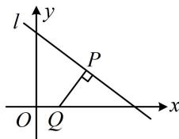

> [!faq]- 《第2节 距离公式》例题解析
>
> > [!success]- **【答案】** B
>
> > [!note]- **【分析】**
> > 本题未单列分析。
>
> > [!note]- **【解析】**
> > 解析：由 $(x - 1)^2 + y^2$ 的结构联想到两点间的距离公式，记 $P(x, y)$ ， $Q(1, 0)$ ，则 $(x - 1)^2 + y^2 = |PQ|^2$
> >
> > 因为 $3x + 4y - 13 = 0$ ，所以 $P$ 是直线 $l:3x + 4y - 13 = 0$ 上的动点，
> >
> > 如图，当 $PQ \perp l$ 时， $|PQ|$ 最小，故可用点到直线的距离公式求该最小值，
> >
> > 所以 $\left|PQ\right|_{\min} = \frac{\left|3\times 1 + 4\times 0 - 13\right|}{\sqrt{3^2 + 4^2}} = 2$ ，故 $(x - 1)^2 +y^2$ 的最小值为4.
> >
> > 
>
> > [!tip]- **【反思】**
> > 解析几何中看到“平方+平方”的结构，常往两点间的距离这个方向思考.
