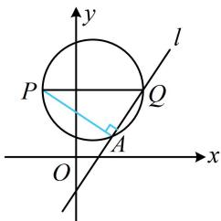

> [!faq]- 《第2节 距离公式》例题解析
>
> > [!success]- **【答案】** D
>
> > [!note]- **【分析】**
> > 本题未单列分析。
>
> > [!note]- **【解析】**
> > 解法1：有点的坐标和直线的方程，可把点 $P$ 到直线 $l$ 的距离用 $k$ 表示，再分析它的取值范围，
> >
> > $y = k(x - 2) + 2 \Rightarrow kx - y + 2 - 2k = 0 \Rightarrow$ 点 $P$ 到直线 $l$ 的距离 $d = \frac{|-k - 2 + 2 - 2k|}{\sqrt{k^2 + (-1)^2}} = \frac{|3k|}{\sqrt{k^2 + 1}} = 3\sqrt{\frac{k^2}{k^2 + 1}} = 3\sqrt{\frac{k^2 + 1 - 1}{k^2 + 1}} = 3\sqrt{1 - \frac{1}{k^2 + 1}}$
> >
> > 因为 $k^2 \geq 0$ ，所以 $k^2 + 1 \geq 1$ ，从而 $0 < \frac{1}{k^2 + 1} \leq 1$ ，故 $0 \leq 1 - \frac{1}{k^2 + 1} < 1$ ，所以 $0 \leq 3\sqrt{1 - \frac{1}{k^2 + 1}} < 3$ ，故 $d \in [0,3)$ 。解法2：观察发现直线 $l$ 过定点，故也可尝试画图分析，先在图中把目标距离作出来，
> >
> > $y = k(x - 2) + 2 \Rightarrow$ 直线 $l$ 过定点 $Q(2,2)$ ，如图，作 $PA \perp l$ 于 $A$
> >
> > 我们就是要分析 $|PA|$ 的取值范围，因为 $P$ 是定点，所以找 $A$ 的轨迹，注意到当 $l$ 绕点 $Q$ 旋转的过程中，始终有 $PA \perp AQ$ ，所以点 $A$ 在以 $PQ$ 为直径的圆上运动，
> >
> > 由于直线 $l$ 的斜率存在，所以 $A$ 不与 $Q$ 重合，那么 $A$ 在圆上运动时，有 $0 \leq |PA| < |PQ| = 3$ ，即点 $P$ 到直线 $l$ 的距离的取值范围是 $[0,3)$ .
> >
> > 
