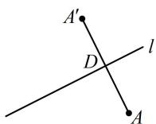

> [!faq]- 《第3节 直线相关的对称问题》参考答案
>
> > [!success]- **【答案】** $(3, - 2)$
>
> > [!note]- **【分析】**
> > 本题未单列分析。
>
> > [!note]- **【解析】**
> > 解析：设 $A(1,2)$ 关于 $l:x - 2y - 2 = 0$ 的对称点是 $A^{\prime}(a,b)$
> >
> > 则 $AA'$ 的中点为 $D\left(\frac{1+a}{2},\frac{2+b}{2}\right)$ ,
> >
> > 如图，应有 $\left\{\begin{aligned}\frac{1+a}{2}-2\times\frac{2+b}{2}-2=0\text{(中点}D\text{在}l\text{上)}\\ \frac{b-2}{a-1}\times\frac{1}{2}&=-1(AA'\perp l)\end{aligned}\right.$
> >
> > 解得： $\left\{\begin{aligned}a&=3\\ b&=-2\end{aligned}\right.$ ，故 $A'(3,-2)$ .
> >
> > 
