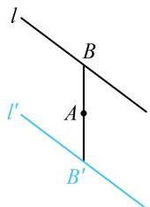

> [!faq]- 《第3节 直线相关的对称问题》参考答案
>
> > [!success]- **【答案】** 详见解析
>
> > [!note]- **【分析】**
> > 本题未单列分析。
>
> > [!note]- **【解析】**
> > 3x - 4y - 3 = 0
> >
> > 解法1: 如图, 关于点对称的两直线平行, 所以两直线斜率相等, 再找一个点即可, 由题意, 点 $B(1,2)$ 在 $l$ 上, 那么它关于点 $A$ 的对称点 $B'(1,0)$ 在 $l'$ 上, 又直线 $l$ 的斜率为 $\frac{3}{4}$ ,
> >
> > 所以 $l'$ 的方程为 $y = \frac{3}{4} (x - 1)$ ，整理得： $3x - 4y - 3 = 0$ 。
> >
> > 解法2：也可设 $B^{\prime}$ 的坐标，通过 $B^{\prime}$ 关于 $A$ 的对称点 $B$ 在 $l$ 上建立关于所设坐标的方程，设 $B^{\prime}(x,y)$ 是 $l^{\prime}$ 上任意一点，则它关于 $A$ 的对称点 $B(2 - x,2 - y)$ 在直线 $l$ 上，
> >
> > 代入直线 l 的方程可得 $3(2-x)-4(2-y)+5=0$ ，
> >
> > 整理得： $3x - 4y - 3 = 0$ ，即 $l^{\prime}:3x - 4y - 3 = 0$
> >
> > 
