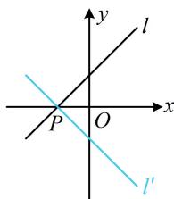

> [!faq]- 《第3节 直线相关的对称问题》参考答案
>
> > [!success]- **【答案】** C
>
> > [!note]- **【分析】**
> > 本题未单列分析。
>
> > [!note]- **【解析】**
> > C
> >
> > 解析：如图，直线 l 与直线 $l'$ 关于 x 轴对称，则 $l'$ 过 l 与 x 轴的交点 P，且 l 和 $l'$ 的斜率互为相反数，
> >
> > $\left\{\begin{aligned}x-y+1&=0\\ y&=0\end{aligned}\right.\Rightarrow\left\{\begin{aligned}x&=-1\\ y&=0\end{aligned}\right.\Rightarrow P(-1,0)$ ，直线l的斜率为1，
> >
> > 所以直线 $l^{\prime}$ 的斜率为-1，故 $l^{\prime}$ 的方程为 $y = -[x - (-1)]$
> >
> > 整理得： $x + y + 1 = 0$
> >
> > 
