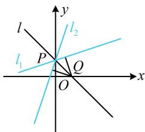

> [!faq]- 《第3节 直线相关的对称问题》参考答案
>
> > [!success]- **【答案】** $3x - y + 1 = 0$
>
> > [!note]- **【分析】**
> > 本题未单列分析。
>
> > [!note]- **【解析】**
> > 解析：如图，直线 $l_{2}$ 过 $l_{1}$ 与l的交点P，先求点P，
> >
> > $\left\{\begin{aligned}x+y-1&=0\\ x-3y+3&=0\end{aligned}\right.\Rightarrow\left\{\begin{aligned}x&=0\\ y&=1\end{aligned}\right.$ ，所以 $P(0,1)$ ，
> >
> > 有一个点了，还差斜率，于是设斜率，并在 $l$ 上另取一点 $Q$ ，由 $Q$ 到 $l_{1}$ 和 $l_{2}$ 距离相等建立方程求斜率，
> >
> > 由图可知 $l_{2}$ 的斜率存在，设其方程为 $y = kx + 1$
> >
> > 即 $kx - y + 1 = 0$ ①,
> >
> > 点 $Q(1,0)$ 在直线 $l$ 上，所以 $Q$ 到 $l_{1}$ 和 $l_{2}$ 的距离相等，
> >
> > 故 $\frac{|1 + 3|}{\sqrt{1^2 + (-3)^2}} = \frac{|k + 1|}{\sqrt{k^2 + (-1)^2}}$ ，解得： $k = 3$ 或 $\frac{1}{3}$
> >
> > 其中 $\frac{1}{3}$ 是 $l_{1}$ 的斜率，舍去，所以 $k = 3$
> >
> > 代入①整理得 $l_{2}$ 的方程为 $3x - y + 1 = 0$ .
> >
> > 
