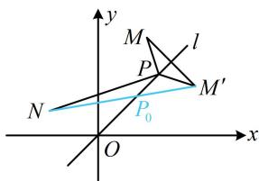

> [!faq]- 《第3节 直线相关的对称问题》参考答案
>
> > [!success]- **【答案】** C
>
> > [!note]- **【分析】**
> > 本题未单列分析。
>
> > [!note]- **【解析】**
> > C
> >
> > 解析：由 $m$ 的形式可联想到距离之和，故考虑画图看看，  
> > 记 $M(2,4)$ ， $N(-2,1)$ ，则 $m = |PM| + |PN|$ 如图， $M,N$ 在直线 $l$ 的同侧，直接分析 $\left|PM\right| + \left|PN\right|$ 的最值不易，可将 $M$ 对称到 $l$ 的另一侧来看，  
> > 设 $M^{\prime}$ 为 $M$ 关于 $l$ 的对称点，则 $\left|PM\right| = \left|PM^{\prime}\right|$ 所以 $\left|PM\right| + \left|PN\right| = \left|PM^{\prime}\right| + \left|PN\right|$ 由三角形两边之和大于第三边可得 $\left|PM^{\prime}\right| + \left|PN\right|\geq \left|M^{\prime}N\right|$ 当且仅当 $P$ 与图中 $P_0$ 重合时取等号，  
> > 所以 $\left|PM\right| + \left|PN\right|$ 的最小值是 $\left|M^{\prime}N\right|$ ，下面先求点 $M^{\prime}$ 的坐标，注意到 $l$ 的斜率为1，可按特殊情况处理， $x - y = 0\Rightarrow \begin{cases} x = y\\ y = x \end{cases}$ ，将点 $M(2,4)$ 代入此二式的右侧可得 $x = 4$ ， $y = 2$ ，所以 $M^{\prime}(4,2)$ 故 $\left|M^{\prime}N\right| = \sqrt{(-2 - 4)^2 + (1 - 2)^2} = \sqrt{37}$ 即 $(|PM| + |PN|)_{\min} = \sqrt{37}$
> >
> > 
> >
> > 已知点 $R$ 在直线 $l: x - y + 1 = 0$ 上， $M(1,3)$ ， $N(3,-1)$ ，则 $\|RM\| - |RN|$ 的最大值为（）A. $\sqrt{5}$ B. $\sqrt{7}$ C. $\sqrt{10}$ D. $2\sqrt{5}$
