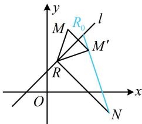

> [!faq]- 《第3节 直线相关的对称问题》参考答案
>
> > [!success]- **【答案】** C
>
> > [!note]- **【分析】**
> > 本题未单列分析。
>
> > [!note]- **【解析】**
> > 解析：如图，M, N 在 l 的两侧，直接分析 $\left\|RM\right| - \left|RN\right|$ 的最大值不易，可考虑将 M 对称到 l 的另一侧，如图，设 $M'$ 是 M 关于直线 l 的对称点，则 $\left|RM\right| = \left|R M'\right|$ ，
> > 所以 $\left\|RM\right|-\left|RN\right|=\left\|RM'\right|-\left|RN\right|$ ,
> > 由三角形两边之差的绝对值小于第三边可得 $\left\|RM'\right|-\left|RN\right|$
> >
> > $\leq \left|M^{\prime}N\right|$ ，当且仅当点 $R$ 与图中 $R_0$ 重合时取等号，
> >
> > 所以 $(\| RM| - |RN|)_{\max} = |MN|$ ，下面先求 $M'$ 的坐标，注意到 $l$ 的斜率为1，可按特殊情况处理， $x - y + 1 = 0 \Rightarrow \begin{cases} x = y - 1 \\ y = x + 1 \end{cases}$ ，将 $M(1,3)$ 代入此二式的右侧可得 $x = 3 - 1 = 2$ ， $y = 1 + 1 = 2$ ，所以 $M'(2,2)$ ，从而 $|MN| = \sqrt{(3 - 2)^2 + (-1 - 2)^2} = \sqrt{10}$ ，故 $\| RM| - |RN|$ 的最大值为 $\sqrt{10}$ .
> >
> > 
