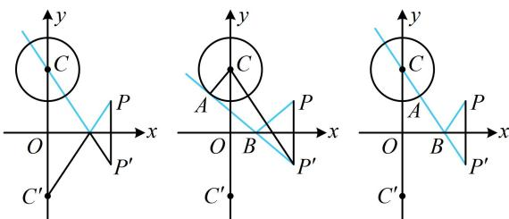

> [!faq]- 《第3节 直线相关的对称问题》参考答案
>
> > [!success]- **【答案】** AB
>
> > [!note]- **【分析】**
> > 本题未单列分析。
>
> > [!note]- **【解析】**
> > AB
> >
> > 解析：涉及入射光线与反射光线的对称问题，先作出已知的点 $P$ 和点 $C$ 关于反射面的对称点，如下列图中的 $P'$ 和 $C'$ ，A项，由题意， $C(0,2)$ ，所以 $C'(0,-2)$ ，从而圆 $C$ 关于 $x$ 轴的对称圆为 $x^2 + (y + 2)^2 = 1$ ，故A项正确；B项，反射光线过圆心时平分周长，如图1，入射光线所在直线即为直线 $PC'$ ，其斜率为 $\frac{-2 - 1}{0 - 2} = \frac{3}{2}$ ，所以 $PC'$ 的方程为 $y = \frac{3}{2} x - 2$ ，整理得： $3x - 2y - 4 = 0$ ，故B项正确；C项，如图2，因为 $|PB| = |P'B|$ ，所以 $|PB| + |BA| = |P'B| + |BA| = |P'A| = \sqrt{|P'C|^2 - |AC|^2}$ ①，由题意， $|AC| = 1$ ， $P'(2,-1)$ ，所以 $|P'C| = \sqrt{(2 - 0)^2 + (-1 - 2)^2} = \sqrt{13}$ ，代入①可得 $|PB| + |BA| = 2\sqrt{3}$ ；若 $AB$ 与圆 $C$ 相切于 $y$ 轴右侧， $|P'A|$ 长度不变，故C项错误；D项，由C项的分析过程知 $|PB| + |BA| = |P'A|$ ，而 $|P'A|$ 最小的情形如图3，此时 $|P'A| = |P'C| - 1 = \sqrt{13} - 1$ ，所以 $|PB| + |BA|$ 的最小值为 $\sqrt{13} - 1$ ，故D项错误.
> >
> > 图1  
> >   
> > 图2  
> > 图3
