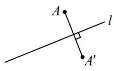
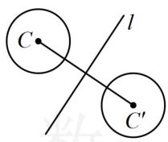
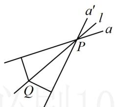
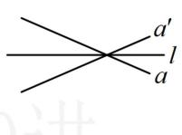
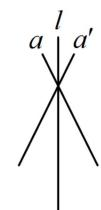

<!-- source-part:1 pages:1-6 -->

# 第3节 直线相关的对称问题（★★☆）

## 内容提要

1. 点关于直线对称: 如图 1, 欲求点 $A$ 关于直线 $l$ 的对称点 $A'$ , 可设 $A'(a,b)$ , 用 $AA' \perp l$ 和 $AA'$ 的中点在直线 $l$ 上来建立方程组求解 $a$ 和 $b$ .

特殊情况：当 $l$ 的斜率是 $\pm 1$ 时，可直接由 $l$ 的方程分别将 $x, y$ 反解出来，再将点 $A$ 的坐标分别代入即可求得 $A'$ 的坐标.

2. 圆关于直线对称：如图2，圆 $C$ 和圆 $C'$ 关于直线 $l$ 对称，则 $C$ 和 $C'$ 关于直线 $l$ 对称，且两圆半径相等.

3. 直线与直线对称：如图3，求直线 $a$ 关于直线 $l$ 的对称直线 $a'$ ，可抓住两点：

①所求直线 $a'$ 经过直线 $a$ 和直线 $l$ 的交点 $P$ ;

②在直线 l 上另取一点 Q，根据点 Q 到直线 a 和 $a'$ 的距离相等建立方程求解 $a'$ 的斜率.

特别地，如图4和图5，若 $l$ 是水平线或竖直线，则 $a$ 和 $a^{\prime}$ 的倾斜角互补，斜率相反.

  
图1

  
图2

  
图3

  
图4

  
图5

![[高中/总复习/教辅/一数常规版2026/第10章 解析几何/模块1 直线与方程/第3节 直线相关的对称问题/类型01_点与线的对称/类型01_点与线的对称.md]]
![[高中/总复习/教辅/一数常规版2026/第10章 解析几何/模块1 直线与方程/第3节 直线相关的对称问题/类型02_圆关于直线的对称/类型02_圆关于直线的对称.md]]
![[高中/总复习/教辅/一数常规版2026/第10章 解析几何/模块1 直线与方程/第3节 直线相关的对称问题/类型03_直线与直线对称/类型03_直线与直线对称.md]]
![[高中/总复习/教辅/一数常规版2026/第10章 解析几何/模块1 直线与方程/第3节 直线相关的对称问题/类型04_线段和与差的最值/类型04_线段和与差的最值.md]]
![[高中/总复习/教辅/一数常规版2026/第10章 解析几何/模块1 直线与方程/第3节 直线相关的对称问题/类型05_入射光线与反射光线的对称/类型05_入射光线与反射光线的对称.md]]
![[高中/总复习/教辅/一数常规版2026/第10章 解析几何/模块1 直线与方程/第3节 直线相关的对称问题/强化训练/强化训练.md]]
