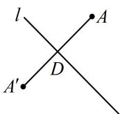

> [!faq]- 《第3节 直线相关的对称问题》例题解析
>
> > [!success]- **【答案】** B
>
> > [!note]- **【分析】**
> > 本题未单列分析。
>
> > [!note]- **【解析】**
> > 解法 1: 求点 $A$ 关于直线 $l$ 的对称点 $A'$ , 抓住 $AA'$ 的中点在 $l$ 上和 $AA' \perp l$ 建立方程组即可,
> >
> > 设 $A$ 关于 $l$ 的对称点是 $A'(a,b)$ ，则 $AA'$ 的中点为 $D\left(\frac{a + 1}{2}, \frac{b + 2}{2}\right)$ ，如图，
> >
> > 应有 $\left\{ \begin{array}{l} \frac{a + 1}{2} + \frac{b + 2}{2} - 2 = 0 (\text{中点在} l \text{上}) \\ \frac{b - 2}{a - 1} \times (-1) = -1 (AA' \perp l) \end{array} \right.$ ，解得： $\left\{ \begin{array}{l} a = 0 \\ b = 1 \end{array} \right.$ ，所以 $A'(0,1)$ .
> >
> > 
> >
> > 解法2: 注意到对称轴的斜率为-1, 故可按内容提要中的特殊情况来处理, 先由对称轴方程反解 $x$ 和 $y$ , $x + y - 2 = 0 \Rightarrow \left\{ \begin{array}{l} x = 2 - y \\ y = 2 - x \end{array} \right.$ , 将 $A(1,2)$ 分别代入此二式的右侧可得 $\left\{ \begin{array}{l} x = 2 - 2 = 0 \\ y = 2 - 1 = 1 \end{array} \right.$ , 故所求对称点为 $(0,1)$ .
>
> > [!tip]- **【反思】**
> > - **①**：求点 $A$ 关于直线 $l$ 的对称点 $A'$ ，关键是抓住 $AA'$ 的中点在 $l$ 上和 $l \perp AA'$ 来建立方程组，这是解决这类问题的通法；
> > - **②**：解法2的做法，只适用于对称轴的斜率为 $\pm 1$ 的情形.
