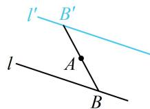

> [!faq]- 《第3节 直线相关的对称问题》例题解析
>
> > [!success]- **【答案】** $x + 3y - 6 = 0$
>
> > [!note]- **【分析】**
> > 本题未单列分析。
>
> > [!note]- **【解析】**
> > 解法1：如图，关于点对称的两直线平行，所以两直线斜率相等，再找一个点即可，
> >
> > 由题意，点 $B(2,0)$ 在 $l$ 上，那么它关于点 $A$ 的对称点 $B'(0,2)$ 在 $l'$ 上，
> >
> > 又直线 $l$ 的斜率为 $-\frac{1}{3}$ ，所以 $l'$ 的方程为 $y = -\frac{1}{3} x + 2$ ，整理得： $x + 3y - 6 = 0$ 。
> >
> > 解法2：要求直线 $l'$ ，可设其上任意一点 $B'$ 的坐标，由 $B'$ 关于 $A$ 的对称点 $B$ 在 $l$ 上建立该坐标的方程，
> >
> > 设 $B'(x, y)$ 是 $l'$ 上任意一点，则它关于 $A$ 的对称点 $B(2 - x, 2 - y)$ 在直线 $l$ 上，
> >
> > 代入直线 l 的方程可得 $(2-x)+3(2-y)-2=0$ ，
> >
> > 整理得： $x + 3y - 6 = 0$ ，所以 $l^{\prime}$ 的方程为 $x + 3y - 6 = 0$
> >
> >
> > 
