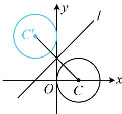

> [!faq]- 《第3节 直线相关的对称问题》例题解析
>
> > [!success]- **【答案】** $(x + 1)^{2} + (y - 2)^{2} = 1$
>
> > [!note]- **【分析】**
> > 本题未单列分析。
>
> > [!note]- **【解析】**
> > 解析：如图，对称圆的圆心 $C'$ 与点 $C$ 关于 $l$ 对称，先求 $C'$ 的坐标，直
> >
> > 线 l 的斜率为 1，可按特殊情况处理，
> >
> > $x - y + 1 = 0 \Rightarrow \left\{ \begin{array}{l} x = y - 1 \\ y = x + 1 \end{array} \right.$ ，将 $C(1,0)$ 代入此二式右侧可得 $\left\{ \begin{array}{l} x = 0 - 1 = -1 \\ y = 1 + 1 = 2 \end{array} \right.$ ，
> >
> > 所以 $C'(-1,2)$ ，故所求圆的方程为 $(x+1)^{2}+(y-2)^{2}=1$ .
> >
> > 
>
> > [!tip]- **【反思】**
> > 求圆 C 关于直线 l 的对称圆 $C'$ ，关键是求点 C 关于直线 l 的对称点 $C'$ ，两圆半径相等.
