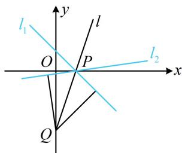

> [!faq]- 《第3节 直线相关的对称问题》例题解析
>
> > [!success]- **【答案】** $x - 7y - 1 = 0$
>
> > [!note]- **【分析】**
> > 本题未单列分析。
>
> > [!note]- **【解析】**
> > 解析：如图，直线 $l_{2}$ 过 $l_{1}$ 与 $l$ 的交点 $P$ ，先求点 $P$ ， $\left\{ \begin{array}{l}x + y - 1 = 0\\ 3x - y - 3 = 0 \end{array} \right.\Rightarrow \left\{ \begin{array}{l}x = 1\\ y = 0 \end{array} \right.$ ，所以 $P(1,0)$
> >
> > 有了点, 还差斜率, 故设斜率, 并在 $l$ 上另取一点 $Q$ , 由 $Q$ 到 $l_{1}$ 和 $l_{2}$ 距离相等建立方程求斜率,
> >
> > 由图可知 $l_{2}$ 的斜率存在，设为 $k$ ，则 $l_{2}$ 的方程为 $y = k(x - 1)$ ，即 $kx - y - k = 0$ ①，
> >
> > 在 $l$ 上另取一点 $Q(0, - 3)$ ，则 $Q$ 到 $l_{1}$ 和 $l_{2}$ 的距离相等，
> >
> > 所以 $\frac{|-3 - 1|}{\sqrt{1^2 + 1^2}} = \frac{|-(-3) - k|}{\sqrt{k^2 + (-1)^2}}$ ，解得： $k = \frac{1}{7}$ 或-1，其中-1是 $l_{1}$ 的斜率，舍去，所以 $k = \frac{1}{7}$ ，代入①整理得 $l_{2}$ 的方程为 $x - 7y - 1 = 0$
> >
> >
> > 
