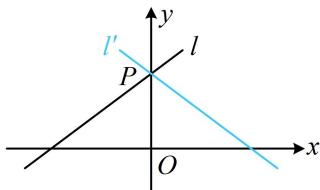

> [!faq]- 《第3节 直线相关的对称问题》例题解析
>
> > [!success]- **【答案】** $3x + 4y - 5 = 0$
>
> > [!note]- **【分析】**
> > 本题未单列分析。
>
> > [!note]- **【解析】**
> > 解析：如图，直线 $l'$ 经过l与y轴的交点P，先求点P的坐标， $\left\{\begin{aligned}&3x-4y+5=0\\&x=0\end{aligned}\right.\Rightarrow y=\frac{5}{4}$ ，所以 $P\left(0,\frac{5}{4}\right)$
> >
> > 由图可知两直线的倾斜角互补，其斜率应互为相反数，
> >
> > 直线 l 的斜率为 $\frac{3}{4}$ ，所以直线 $l'$ 的斜率为 $-\frac{3}{4}$ ，
> >
> > 故直线 $l'$ 的方程为 $y = -\frac{3}{4} x + \frac{5}{4}$ ，整理得： $3x + 4y - 5 = 0$ .
> >
> > 
