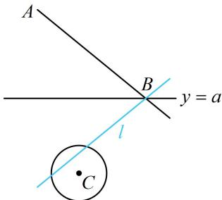

> [!faq]- 《第3节 直线相关的对称问题》例题解析
>
> > [!success]- **【答案】** $\left[\frac{1}{3},\frac{3}{2}\right]$
>
> > [!note]- **【分析】**
> > 本题未单列分析。
>
> > [!note]- **【解析】**
> > 解析：$y = a$ 是水平线，关于水平线对称的两直线倾斜角互补，斜率相反，所以直线 $l$ 的方程易求出，如图，注意到点 $B$ 在直线 $y = a$ 上，所以直线 $l$ 也过点 $B$
> >
> > 因为 $k_{AB} = \frac{3 - a}{-2 - 0} = \frac{a - 3}{2}$ ，所以 $l$ 的斜率为 $\frac{3 - a}{2}$ ，故 $l$ 的方程为 $y = \frac{3 - a}{2} x + a$ ，即 $(3 - a)x - 2y + 2a = 0$ ，
> >
> > 直线 l 与圆 C 有公共点可翻译成圆心到直线 l 的距离 $d \leq r$ ,
> >
> > 可由此建立不等式求 $a$ 的范围，
> >
> > 因为 $l$ 与圆 $C$ 有公共点, 所以圆心 $C(-3, -2)$ 到 $l$ 的距离
> >
> > $d = \frac{\left|(3 - a)\times(-3) - 2\times(-2) + 2a\right|}{\sqrt{(3 - a)^{2} + 4}}\leq 1$ ，解得： $\frac{1}{3}\leq a\leq \frac{3}{2}$
> >
> > 
>
> > [!tip]- **【总结】**
> > 从例 3 及其后的两个变式可以看出，当对称轴不与坐标轴垂直时，可在对称轴上另取一点，由该点到两直线距离相等来求斜率；当对称轴与坐标轴垂直时，直接由两直线斜率相反即可求斜率.
