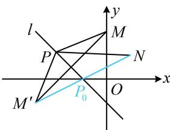

> [!faq]- 《第3节 直线相关的对称问题》例题解析
>
> > [!success]- **【答案】** $2 \sqrt{5}$
>
> > [!note]- **【分析】**
> > 本题未单列分析。
>
> > [!note]- **【解析】**
> > 解析：$M, N$ 在 $l$ 的同侧，直接分析 $\left|PM\right| + \left|PN\right|$ 的最值不易，可将 $M$ 对称到 $l$ 的另一侧，转化为求 $l$ 上的动点到其两侧定点的距离之和的最小值来分析，
> >
> > 如图，设 $M^{\prime}$ 是 $M$ 关于直线 $l$ 的对称点，则 $\left|PM\right| = \left|PM'\right|$ ，所以 $\left|PM\right| + \left|PN\right| = \left|PM'\right| + \left|PN\right|$ ，
> >
> > 由三角形两边之和大于第三边可得 $\left|PM^{\prime}\right|+\left|PN\right|\geq\left|M^{\prime}N\right|$ ，当且仅当P与图中 $P_{0}$ 重合时取等号，
> >
> > 所以 $\left|PM\right|+\left|PN\right|$ 的最小值是 $\left|M'N\right|$ ,
> >
> > 求 $|MN|$ 要用 $M'$ 的坐标，先求它，注意到 l 的斜率为 -1，可按特殊情况处理， $x + y + 1 = 0 \Rightarrow \begin{cases} x = -y - 1 \\ y = -x - 1 \end{cases}$ ，将点 $M(0,2)$ 代入此二式的右侧可得 $\left\{\begin{aligned}x&=-2-1=-3\\ y&=-0-1=-1\end{aligned}\right.$ 所以 $M'(-3,-1)$ ，故 $\left|M'N\right|=\sqrt{(-3-1)^{2}+(-1-1)^{2}}=2\sqrt{5}$ ，即 $\left(\left|PM\right|+\left|PN\right|\right)_{\min}=2\sqrt{5}$ .
> >
> > 
>
> > [!tip]- **【反思】**
> > 定直线 l 上的动点 P 到其同侧两定点 M, N 的距离之和的最小值，可通过将 M 或 N 对称到 l 的另一侧，借助三角形两边之和大于第三边来分析.
