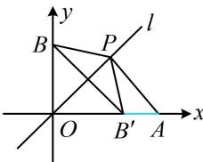

> [!faq]- 《第3节 直线相关的对称问题》例题解析
>
> > [!success]- **【答案】** A
>
> > [!note]- **【分析】**
> > 本题未单列分析。
>
> > [!note]- **【解析】**
> > A. 1 B. 2 C. 3 D. 4
> >
> > 解析：由题意，直线 $2x + 3y - 6 = 0$ 与 $x$ 轴交于点 $A(3,0)$ ，与 $y$ 轴交于点 $B(0,2)$ ，如图， $A$ ， $B$ 在 $l$ 两侧，直接分析 $|PA| - |PB|$ 的最大值不易，可将 $B$ 对称到 $l$ 的另一侧，设 $B'$ 是 $B$ 关于直线 $l$ 的对称点，则 $B'(2,0)$ ，且 $|PB| = |PB'|$ ，所以 $|PA| - |PB| = |PA| - |PB'|$ ，由三角形两边之差小于第三边可得 $|PA| - |PB'| \leq |AB'|$ ，当且仅当点 $P$ 与点 $O$ 重合时取等号，所以 $(|PA| - |PB|)_{\max} = |AB'| = 1$ 。
> >
> > 
>
> > [!tip]- **【反思】**
> > 定直线 $l$ 上的动点 $P$ 到其异侧两定点 $A, B$ 的距离之差的最大值，可通过将 $A$ 或 $B$ 对称到 $l$ 的另一侧，借助三角形两边之差小于第三边来分析.
