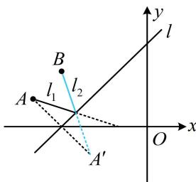
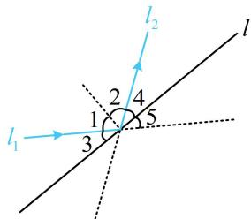

> [!faq]- 《第3节 直线相关的对称问题》例题解析
>
> > [!success]- **【答案】** $3x + y + 7 = 0$
>
> > [!note]- **【分析】**
> > 本题未单列分析。
>
> > [!note]- **【解析】**
> > 解析：如图，入射光线 $l_{1}$ 和反射光线 $l_{2}$ 关于直线 l 对称，所以 A 关于 l 的对称点 $A'$ 在 $l_{2}$ 上，先求 $A'$ 的坐标，直线 l 的斜率为 1，可按特殊情况处理，
> >
> > $x - y + 3 = 0 \Rightarrow \left\{ \begin{array}{l} x = y - 3 \\ y = x + 3 \end{array} \right.$ ，将点 $A(-4,1)$ 代入此二式的右侧可得 $\left\{ \begin{array}{l} x = 1 - 3 = -2 \\ y = -4 + 3 = -1 \end{array} \right.$ ，所以 $A'(-2,-1)$ ，直线 $l_2$ 即为直线 $A'B$ ，其斜率为 $\frac{-1 - 2}{-2 - (-3)} = -3$ ，故 $l_2$ 的方程为 $y - 2 = -3[x - (-3)]$ ，整理得： $3x + y + 7 = 0$ 。
> >
> > 
>
> > [!tip]- **【反思】**
> > 如图， $\angle 1 = \angle 2 \Rightarrow \angle 3 = \angle 4$ ，又 $\angle 3 = \angle 5$ ，所以 $\angle 4 = \angle 5$ ，从而入射光线 $l_{1}$ 与反射光线 $l_{2}$ 关于直线 $l$ 对称，利用此性质可解决大部分的光线入射与反射问题，其本质仍是点关于线的对称.
> >
> > 
