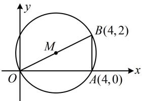

> [!faq]- 《第1节 圆的方程》参考答案
>
> > [!success]- **【答案】** 详见解析
>
> > [!note]- **【分析】**
> > 本题未单列分析。
>
> > [!note]- **【解析】**
> > $(x - 2)^{2} + (y - 1)^{2} = 5$ （答案不唯一，详见解析）
> >
> > 解法1：任选三点，设圆的一般式方程，把三点的坐标代入，都可用待定系数法求得圆的方程，
> >
> > 若选 $(0,0)$ ，(4,0)，(-1,1)，设过该三点的圆的方程为
> >
> > $$
> > x ^ {2} + y ^ {2} + D x + E y + F = 0
> > $$
> >
> > 将上述三点的坐标代入可得 $\left\{\begin{aligned}F&=0\\ 16+4D+F&=0\\ 2-D+E+F&=0\end{aligned}\right.$ ，
> >
> > 解得： $D = -4$ ， $E = -6$ ， $F = 0$
> >
> > 故过上述三点的圆的方程为 $x^{2} + y^{2} - 4x - 6y = 0$
> >
> > 同理，若选(0,0)，(4,0)，(4,2)，
> >
> > 则可求得圆的方程为 $x^{2} + y^{2} - 4x - 2y = 0$
> >
> > 若选(0,0)， $(-1,1)$ ， $(4,2)$ ，
> >
> > 则可求得圆的方程为 $x^{2} + y^{2} - \frac{8}{3} x - \frac{14}{3} y = 0$
> >
> > 若选(4,0)， $(-1,1)$ ， $(4,2)$ ，
> >
> > 则可求得圆的方程为 $x^{2} + y^{2} - \frac{16}{5} x - 2y - \frac{16}{5} = 0$
> >
> > 解法2：所给的点都是整点，容易画到坐标系下，故可先画图观察，看能否选择三点，快速找到圆心和半径，如图，记 $O(0,0)$ ， $A(4,0)$ ， $B(4,2)$ ，则 $AB \perp OA$ ，
> >
> > 所以过 $O, A, B$ 三点的圆即为以 $OB$ 为直径的圆，该圆的方程易于计算，于是就选这三点，
> >
> > 圆心为 $OB$ 中点 $M(2,1)$ ，半径 $r = |OM| = \sqrt{5}$ ，
> >
> > 故该圆的方程为 $(x - 2)^{2} + (y - 1)^{2} = 5$
> >
> > 
