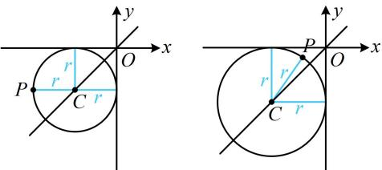

> [!faq]- 《第1节 圆的方程》参考答案
>
> > [!success]- **【答案】** $(x + 1)^2 +(y + 1)^2 = 1$ 或 $(x + 5)^2 +(y + 5)^2 = 25$
>
> > [!note]- **【分析】**
> > 本题未单列分析。
>
> > [!note]- **【解析】**
> > 解析：如图，过点 $P$ 且与两坐标轴都相切的圆，圆心在第三象限且在直线 $y = x$ 上，
> >
> > 故可设圆心坐标，利用圆心到任意一条坐标轴的距离与到点 $P$ 的距离相等建立方程求圆心，
> >
> > 由图知可设圆心为 $C(-r, - r)(r > 0)$ ，则由题意，
> >
> > $r = \sqrt{(-r + 2)^2 + (-r + 1)^2}$ ，解得： $r = 1$ 或5，所以圆 $C$ 的
> >
> > 方程为 $(x + 1)^2 +(y + 1)^2 = 1$ 或 $(x + 5)^2 +(y + 5)^2 = 25$
> >
> > 
