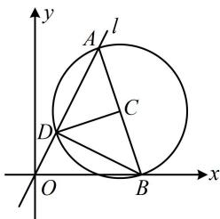

> [!faq]- 《第1节 圆的方程》参考答案
>
> > [!success]- **【答案】** $(x - 4)^{2} + (y - 3)^{2} = 10$
>
> > [!note]- **【分析】**
> > 本题未单列分析。
>
> > [!note]- **【解析】**
> > 解析：如图，因为 $AB$ 是直径，所以 $AD \perp BD$ ，
> >
> > 由这一垂直关系, 结合已知 $l$ 的斜率, 可求得 $B D$ 的斜率, $B$ 又已知, 故可求得点 $D$ 的坐标,
> >
> > 由题意，直线 $AD$ 的斜率为2，故直线 $BD$ 的斜率为 $-\frac{1}{2}$ ，
> >
> > 设 $D(a,2a)$ ，则 $k_{BD} = \frac{2a}{a - 5} = -\frac{1}{2}$ ，解得： $a = 1$ ，故 $D(1,2)$
> >
> > 再求圆心 C，C 是 AB 中点，故可设 A 的坐标，利用 $AB \perp CD$ 来建立方程求解，
> >
> > 设 $A(b,2b)$ ，则 $C\left(\frac{b + 5}{2},b\right)$ ，因为 $AB\bot CD$
> >
> > 所以 $k_{AB} \cdot k_{CD} = \frac{2b}{b - 5} \cdot \frac{b - 2}{\frac{b + 5}{2} - 1} = -1$ ，解得： $b = 3$ 或-1，
> >
> > 因为 $A$ 在第一象限，所以 $b > 0$ ，从而 $b = 3$ ，故 $C(4,3)$
> >
> > $$
> > \left| C D \right| = \sqrt {(4 - 1) ^ {2} + (3 - 2) ^ {2}} = \sqrt {1 0}
> > $$
> >
> > 所以圆 $C$ 的方程为 $(x - 4)^2 +(y - 3)^2 = 10$
> >
> > 
