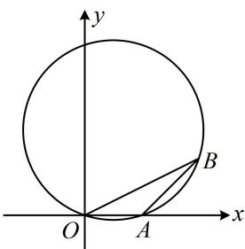

> [!faq]- 《第1节 圆的方程》例题解析
>
> > [!success]- **【答案】** $x^{2} + y^{2} - 2x - 6y = 0$
>
> > [!note]- **【分析】**
> > 本题未单列分析。
>
> > [!note]- **【解析】**
> > 解析：如图，已知圆上三点，可设一般式方程，把点代入建立方程组求解系数，
> >
> > 设 $\triangle AOB$ 外接圆的方程为 $x^{2} + y^{2} + Dx + Ey + F = 0$
> >
> > 将 $A, B, O$ 的坐标代入可得 $\left\{ \begin{array}{l} 4 + 2D + F = 0 \\ 20 + 4D + 2E + F = 0 \\ F = 0 \end{array} \right.$ ，解得： $\left\{ \begin{array}{l} D = -2 \\ E = -6 \\ F = 0 \end{array} \right.$
> >
> > 所以 $\triangle AOB$ 外接圆的方程为 $x^{2} + y^{2} - 2x - 6y = 0$
> >
> >
> > 
