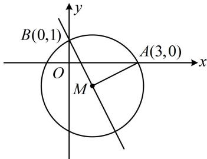

> [!faq]- 《第1节 圆的方程》例题解析
>
> > [!success]- **【答案】** $(x - 1)^{2} + (y + 1)^{2} = 5$
>
> > [!note]- **【分析】**
> > 本题未单列分析。
>
> > [!note]- **【解析】**
> > 解析：$2x + y - 1 = 0 \Rightarrow y = 1 - 2x$ ，由题意，圆心 M 在直线 y = 1 - 2x 上，故可设 $M(a, 1 - 2a)$ ，
> >
> > 要求圆心坐标, 可用 $M$ 与所给圆上两点的距离相等来建立关于 $a$ 的方程,
> >
> > 如图， $\left|MA\right|=\left|MB\right|$ ，所以 $\sqrt{(a-3)^{2}+(1-2a)^{2}}=\sqrt{a^{2}+[1-(1-2a)]^{2}}$
> >
> > 解得： $a = 1$ ，故圆心为 $(1, - 1)$ ，半径 $r = |MA| = \sqrt{(1 - 3)^2 + (-1 - 0)^2} = \sqrt{5}$
> >
> > 所以 $\odot M$ 的方程为 $(x - 1)^2 +(y + 1)^2 = 5$
> >
> >
> > 
