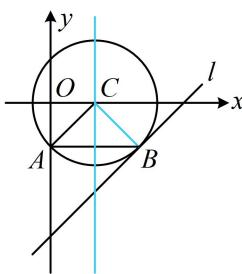

> [!faq]- 《第1节 圆的方程》例题解析
>
> > [!success]- **【答案】** $(x - 1)^{2} + y^{2} = 2$
>
> > [!note]- **【分析】**
> > 本题未单列分析。
>
> > [!note]- **【解析】**
> > 解析：先找圆心，如图，圆心应在过 $B$ 且与 $l$ 垂直的直线上，也在 $AB$ 的中垂线上，
> >
> > 故圆心是它们的交点，
> > 由题意，过 B 且与 l 垂直的直线为 $y-(-1)=-(x-2)$ ，即 $x+y-1=0$ ，
> > 线段 AB 的中垂线为 x=1，联立 $\left\{\begin{aligned}x+y-1&=0\\ x&=1\end{aligned}\right.$ 解得： $\left\{\begin{aligned}x&=1\\ y&=0\end{aligned}\right.$ 所以圆心为 $C(1,0)$ ，半径 $r=\left|CA\right|=\sqrt{2}$ ，故所求圆的方程为 $(x-1)^{2}+y^{2}=2$ 。
> >
> >
> > 
>
> > [!tip]- **【总结】**
> > 求圆的方程常用三种方法：①设圆的一般式方程，并建立关于系数的方程组，已知圆上三点常用此法；
> > - **②**：利用圆上点到圆心距离为半径列方程，已知圆心坐标性质时常用此法；
> > - **③**：利用弦的中垂线过圆心来找圆心，再求半径.
