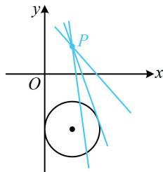

> [!faq]- 《第2节 直线与圆的位置关系》参考答案
>
> > [!success]- **【答案】** D
>
> > [!note]- **【分析】**
> > 本题未单列分析。
>
> > [!note]- **【解析】**
> > D
> >
> > D解析：直线 $l$ 的方程含参，先看是否过定点，直线 $l$ 的方程可化为 $k(x - 1) - (y - 1) = 0$ ，所以直线 $l$ 过定点 $P(1,1)$ 点 $P$ 与圆 $C$ 的位置关系决定直线 $l$ 与圆 $C$ 可能的位置关系，故先判断 $P$ 与圆 $C$ 的位置关系，因为 $1^{2} + 1^{2} - 2\times 1 + 4\times 1 + 4 = 8 > 0$ ，所以点 $P$ 在圆 $C$ 外，如图， $l$ 与圆 $C$ 的位置关系不确定，与 $k$ 有关.
> >
> > 
>
> > [!tip]- **【反思】**
> > 对于定圆 C，当直线 l 绕定点 P 旋转时：①若 P 在圆 C 内，则直线 l 与圆 C 必定相交；
> > - **②**：若 P 在圆 C 上，则直线 l 与圆 C 相切或相交；
> > - **③**：若 P 在圆 C 外，则直线 l 与圆 C 相离、相切或相交均有可能.
