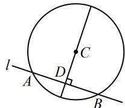

> [!faq]- 《第2节 直线与圆的位置关系》参考答案
>
> > [!success]- **【答案】** C
>
> > [!note]- **【分析】**
> > 本题未单列分析。
>
> > [!note]- **【解析】**
> > C
> > 解析： $x^{2}+y^{2}+2x-4y-20=0\Rightarrow(x+1)^{2}+(y-2)^{2}=25$
> >
> > 所以圆 $C$ 的圆心为 $C(-1,2)$ ，有了一个点，求直线还差斜率，涉及弦中点，可由垂径定理构建垂直关系来算斜率，如图，设 $AB$ 中点为 $D$ ，则 $CD \perp l$ ， $x + 3y + 5 = 0 \Rightarrow y = -\frac{1}{3} x - \frac{5}{3} \Rightarrow$ 直线 $l$ 的斜率为 $-\frac{1}{3}$ ，
> >
> > 所以直线 $CD$ 的斜率为3，结合 $C(-1,2)$ 可得直线 $CD$ 的方程为 $y - 2 = 3[x - (-1)]$ ，整理得： $3x - y + 5 = 0$
> >
> > 
