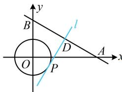

> [!faq]- 《第2节 直线与圆的位置关系》参考答案
>
> > [!success]- **【答案】** $\frac{1}{2}$
>
> > [!note]- **【分析】**
> > 本题未单列分析。
>
> > [!note]- **【解析】**
> > 解析：所给直线与坐标轴的交点 $A, B$ 的坐标可求，先把它们求出来，
> >
> > 联立 $\left\{ \begin{array}{l} y = 0 \\ x + \sqrt{3}y - \sqrt{3} = 0 \end{array} \right.$ 解得： $x = \sqrt{3}$ ，所以 $A(\sqrt{3}, 0)$ ，
> >
> > 联立 $\left\{ \begin{array}{l} x = 0 \\ x + \sqrt{3} y - \sqrt{3} = 0 \end{array} \right.$ 解得： $y = 1$ ，所以 $B(0,1)$
> >
> > 怎样翻译圆 O 上只有 1 个点 P 满足 $\left|AP\right|=\left|BP\right|$ ？由于满足 $\left|AP\right|=\left|BP\right|$ 的点 P 在线段 AB 的中垂线上，所以问题等价于 AB 的中垂线与圆 O 只有 1 个交点，
> >
> > 如图， $AB$ 中点为 $D\left(\frac{\sqrt{3}}{2},\frac{1}{2}\right)$ ，直线 $AB$ 的斜率为 $-\frac{\sqrt{3}}{3}$
> >
> > 所以 $AB$ 中垂线 $l$ 的斜率为 $\sqrt{3}$
> >
> > 故 $AB$ 中垂线 $l$ 的方程为 $y - \frac{1}{2} = \sqrt{3}\left(x - \frac{\sqrt{3}}{2}\right)$
> >
> > 整理得： $\sqrt{3} x - y - 1 = 0$ ，由题意，圆 $O$ 与直线 $l$ 相切，
> >
> > 所以 $d = \frac{|-1|}{\sqrt{(\sqrt{3})^2 + (-1)^2}} = r$ ，故 $r = \frac{1}{2}$
> >
> > 
