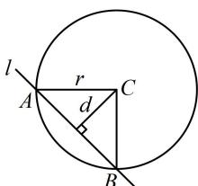

> [!faq]- 《第2节 直线与圆的位置关系》参考答案
>
> > [!success]- **【答案】** -3或1
>
> > [!note]- **【分析】**
> > 本题未单列分析。
>
> > [!note]- **【解析】**
> > 解析：$x^{2} + y^{2} + 2y - 3 = 0\Rightarrow x^{2} + (y + 1)^{2} = 4$
> >
> > 所以圆心为 $C(0,-1)$ ，半径 r=2，
> >
> > 两段圆弧的比例决定了圆心角，圆心角又与圆心到直线的距离 $d$ 有关，故可由此求出 $d$
> >
> > 如图， $l$ 把圆 $C$ 分成1:3的两段圆弧 $\Rightarrow \angle ACB = 90^{\circ}$
> >
> > 所以 $\triangle ABC$ 为等腰直角三角形，故 $d = \frac{\sqrt{2}}{2} r = \sqrt{2}$
> >
> > 又 $d = \frac{|-1 - k|}{\sqrt{1^2 + 1^2}} = \frac{|1 + k|}{\sqrt{2}}$ ，所以 $\frac{|1 + k|}{\sqrt{2}} = \sqrt{2}$ ，故 $k = -3$ 或1.
> >
> > 
