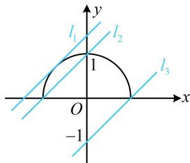

> [!faq]- 《第2节 直线与圆的位置关系》参考答案
>
> > [!success]- **【答案】** D
>
> > [!note]- **【分析】**
> > 本题未单列分析。
>
> > [!note]- **【解析】**
> > 解析：我们习惯于用 $x$ 表示方程的未知数，故不妨先把所给方程中的 $y$ 都换成 $x$ 问题等价于关于 $x$ 的方程 $x - b = \sqrt{1 - x^2}$ 恰有1个实数解，
> >
> > 可数形结合, 作出两边代数式对应的图象, 即可转化为直线 $l: y = x - b$ 与曲线 $y = \sqrt{1 - x^2}$ 恰有 1 个交点, 曲线的方程带根号, 先平方去根号,
> >
> > $$
> > y = \sqrt {1 - x ^ {2}} \Rightarrow y ^ {2} = 1 - x ^ {2} \Rightarrow x ^ {2} + y ^ {2} = 1 (y \geq 0)
> > $$
> >
> > 该方程表示单位圆的上半部分，可画图分析临界状态，
> >
> > 如图，满足条件的直线 $l$ 可在 $l_{2}$ （不可取）和 $l_{3}$ （可取）
> >
> > 之间，或恰好为 $l_{1}$ ，
> >
> > 注意到 $-b$ 是直线 $l$ 在 $y$ 轴上的截距，所以当直线 $l$ 在 $l_{2}$ 和
> >
> > $l_{3}$ 之间时， $-1\leq-b<1$ ，故 $-1<b\leq1$ ；
> >
> > 直线 $l_{1}$ 与半圆相切， $y = x - b \Rightarrow x - y - b = 0$ ，所以原点到直线 $l_{1}$ 的距离 $d = \frac{|-b|}{\sqrt{1^2 + (-1)^2}} = 1$ ，解得： $b = \pm \sqrt{2}$ ，由图可知， $l_{1}$ 的纵截距为正 $\Rightarrow -b = \sqrt{2} \Rightarrow b = -\sqrt{2}$ ；
> >
> > 综上所述，实数 $b$ 的取值范围是 $(-1,1] \cup \{-\sqrt{2}\}$ .
> >
> > 
