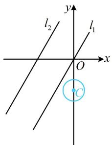
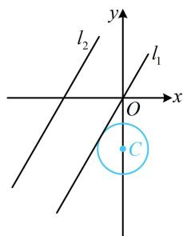
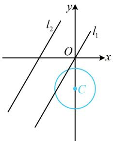
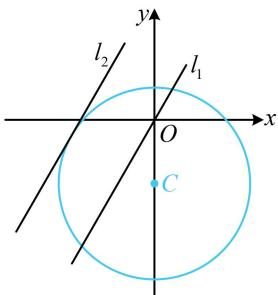

> [!faq]- 《第2节 直线与圆的位置关系》参考答案
>
> > [!success]- **【答案】** B
>
> > [!note]- **【分析】**
> > 本题未单列分析。
>
> > [!note]- **【解析】**
> > B
> >
> > 解析：可以想象，到所给直线距离为1的所有点的轨迹，应为两条与该直线平行的直线，不妨先求出这两条线，再作观察，记直线 $y = \sqrt{3} x + 2$ 为 $l$ ，其方程可化为 $\sqrt{3} x - y + 2 = 0$ ，设与 $l$ 平行且距离为1的直线为 $\sqrt{3} x - y + m = 0$ ，则 $\frac{|m - 2|}{\sqrt{(\sqrt{3})^2 + (-1)^2}} = 1$ ，解得： $m = 0$ 或4，所以题设条件等价于所给圆与 $l_{1}:\sqrt{3} x - y = 0$ 和 $l_{2}:\sqrt{3} x - y + 4 = 0$ 共有2个交点，
> >
> > 所给圆的圆心固定，半径可变，故可让 $r$ 从0开始增大，想象图象的变化过程，寻找临界状态，
> >
> > 所给圆的圆心为 $C(0, -2)$
> >
> > 点 $C$ 到 $l_{1}$ 的距离 $d_{1} = \frac{|-(-2)|}{\sqrt{(\sqrt{3})^{2} + (-1)^{2}}} = 1$
> >
> > 到 $l_{2}$ 的距离 $d_{2} = \frac{|-(-2) + 4|}{\sqrt{(\sqrt{3})^{2} + (-1)^{2}}} = 3$
> >
> > 当 $r$ 从0开始增大时，如图1，起初圆 $C$ 与 $l_{1}$ 和 $l_{2}$ 都没有交点，不合题意；当 $r$ 增大到1时，如图2，圆 $C$ 仅与 $l_{1}$ 有1个交点，不合题意；
> >
> >   
> > 图1
> >
> >   
> > 图2
> >
> > 当 $r$ 继续增大时，起初如图3，圆 $C$ 仅与 $l_{1}$ 有2个交点，满足题意；
> >
> > 当 $r$ 继续增大，直到 $r \geq 3$ 时，如图4，圆 $C$ 与 $l_{1}$ 有2个交点，且与 $l_{2}$ 至少有1个交点，不合题意；综上所述， $r$ 的取值范围是(1,3).
> >
> >   
> > 图3
> >
> >   
> > 图4
> >
> > 一数·必刷100讲
