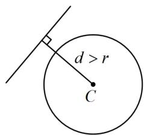
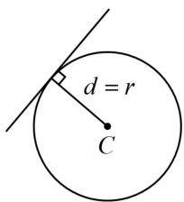
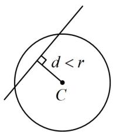
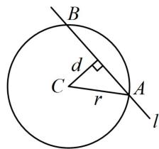

<!-- source-part:1 pages:1-5 -->

# 第2节 直线与圆的位置关系（★★）

## 内容提要

1. 判断直线 $l: Ax + By + C = 0$ 与圆 $C: (x - a)^2 + (y - b)^2 = r^2$ 的位置关系的步骤：

①计算圆心 $C(a,b)$ 到直线l的距离d；

②将 $d$ 和 $r$ 进行比较: 若 $d > r$ , 则直线和圆相离, 它们没有交点, 如图 1; 若 $d = r$ , 则直线和圆相切, 它们有 1 个交点, 如图 2; 若 $d < r$ , 则直线和圆相交, 它们有 2 个交点, 如图 3.

  
图1

  
图2

  
图3

  
图4

2. 当直线与圆相交时, 如上图 4, 两个交点之间的线段长度, 称为直线被圆截得的弦长, 计算的步骤是:

①计算圆心 C 到直线 l 的距离 d；②弦长 $\left|AB\right|=2\sqrt{r^{2}-d^{2}}$

![[高中/总复习/教辅/一数常规版2026/第10章 解析几何/模块2 圆与方程/第2节 直线与圆的位置关系/类型01_判断直线与圆的位置关系/类型01_判断直线与圆的位置关系.md]]
![[高中/总复习/教辅/一数常规版2026/第10章 解析几何/模块2 圆与方程/第2节 直线与圆的位置关系/类型02_用垂径定理计算弦的方程/类型02_用垂径定理计算弦的方程.md]]
![[高中/总复习/教辅/一数常规版2026/第10章 解析几何/模块2 圆与方程/第2节 直线与圆的位置关系/类型03_直线被圆截得的弦长/类型03_直线被圆截得的弦长.md]]
![[高中/总复习/教辅/一数常规版2026/第10章 解析几何/模块2 圆与方程/第2节 直线与圆的位置关系/类型04_由直线与圆的位置关系求参数范围/类型04_由直线与圆的位置关系求参数范围.md]]
![[高中/总复习/教辅/一数常规版2026/第10章 解析几何/模块2 圆与方程/第2节 直线与圆的位置关系/强化训练/强化训练.md]]
