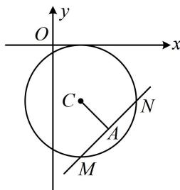

> [!faq]- 《第2节 直线与圆的位置关系》例题解析
>
> > [!success]- **【答案】** B
>
> > [!note]- **【分析】**
> > 本题未单列分析。
>
> > [!note]- **【解析】**
> > 解析：$x^{2} + y^{2} - 2x + 4y + 1 = 0\Rightarrow (x - 1)^{2} + (y + 2)^{2} = 4\Rightarrow$ 圆心为 $C(1, - 2)$
> >
> > 在圆中涉及弦中点，想到垂径定理，如图， $A$ 为弦 $MN$ 的中点 $\Rightarrow AC \perp MN$ ，因为 $k_{AC} = \frac{-3 - (-2)}{2 - 1} = -1$ ，所以 $k_{MN} = 1$
> >
> > 故直线 MN 方程是 $y-(-3)=x-2$ ，整理得：x-y-5=0。
> >
> >
> > 
