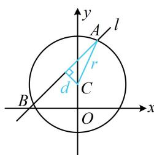

> [!faq]- 《第2节 直线与圆的位置关系》例题解析
>
> > [!success]- **【答案】** $\sqrt{14}$
>
> > [!note]- **【分析】**
> > 本题未单列分析。
>
> > [!note]- **【解析】**
> > 解析：涉及圆的弦长，一般在如图所示的蓝色直角三角形中由勾股定理来算，下面先求 $d$ ，
> >
> > 由题意，圆心 $C(0,1)$ 到直线 $l$ 的距离 $d = \frac{|-1 + 2|}{\sqrt{1^2 + (-1)^2}} = \frac{\sqrt{2}}{2}$ ，
> >
> > 所以弦长 $|AB|=2\sqrt{r^{2}-d^{2}}=2\sqrt{4-\frac{1}{2}}=\sqrt{14}$ .
> >
> > 
