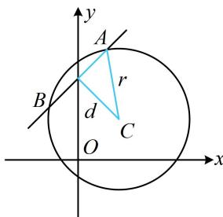

> [!faq]- 《第2节 直线与圆的位置关系》例题解析
>
> > [!success]- **【答案】** 2
>
> > [!note]- **【分析】**
> > 本题未单列分析。
>
> > [!note]- **【解析】**
> > 解析：涉及圆的弦长，先算 $d$ ，如图，圆心为 $C(1,1)$ ，半径 $r = \sqrt{3}$ ， $d = \frac{|1 - 1 + m|}{\sqrt{1^2 + (-1)^2}} = \frac{|m|}{\sqrt{2}}$ 所以直线与圆相交所得弦长 $\left|AB\right|=2\sqrt{r^{2}-d^{2}}=2\sqrt{3-\frac{m^{2}}{2}}$ 由题意， $2\sqrt{3-\frac{m^{2}}{2}}=m$ ，解得：m=2。
> >
> >
> > 
>
> > [!tip]- **【反思】**
> > 从例 3 和它的变式可以看出, 求弦长基本都会转化到点到直线的距离 d 上来.
