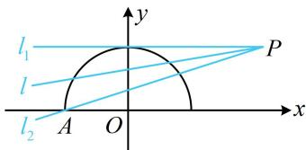

> [!faq]- 《第2节 直线与圆的位置关系》例题解析
>
> > [!success]- **【答案】** C
>
> > [!note]- **【分析】**
> > 本题未单列分析。
>
> > [!note]- **【解析】**
> > A. $k > \frac{1}{3}$ B. 0 < k < 3 C. $0 < k \leq \frac{1}{3}$ D. $-3 \leq k < 0$
> >
> > 解析：所给函数带根号，为了弄清楚其图象的样子，先通过平方去根号，
> >
> > $y=\sqrt{1-x^{2}}\Rightarrow y^{2}=1-x^{2}\Rightarrow x^{2}+y^{2}=1(y\geq0)$ ，其图象为以原点为圆心，1为半径的圆的上半部分， $y=kx+1-2k\Rightarrow y=k(x-2)+1\Rightarrow$ 直线 l 过定点 $P(2,1)$ ，两个图象都不复杂，故可画图找临界状态，如图，当直线 l 从 $l_{1}$ （不可取）绕点 P 逆时针旋转至 $l_{2}$ （可取）的过程中，能与半圆有 2 个交点，
> >
> > 下面求解临界状态， $l_{1}$ 与半圆相切，结合图形可知其斜率 $k_{1}=0$ ；
> >
> > $l_{2}$ 经过 $P$ 和 $A(-1,0)$ ，其斜率 $k_{2} = \frac{0 - 1}{-1 - 2} = \frac{1}{3}$ ；
> >
> > 直线 l 在旋转过程中不经过竖直线，故其斜率 k 的变化范围是 $\left(0, \frac{1}{3}\right]$ .
> >
> > 
>
> > [!tip]- **【反思】**
> > - **①**：解析几何中出现根式，可尝试通过平方变形成圆、椭圆等二次曲线，由于根号的范围限制，曲线往往只能取一半；
> > - **②**：原题其实为“若方程 $kx + 1 - 2k = \sqrt{1 - x^2}$ 有2个实数根，求 $k$ 的范围”，你会做吗？只需数形结合，即可转化为本题的公共点问题.
