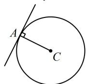

> [!faq]- 《第3节 圆的切线有关的计算》参考答案
>
> > [!success]- **【答案】** 详见解析
>
> > [!note]- **【分析】**
> > 本题未单列分析。
>
> > [!note]- **【解析】**
> > -2, $\sqrt{5}$
> >
> > 解法1：如图，由题意，应有 $AC \perp l$
> >
> > 所以 $2 \cdot \frac{m + 1}{2} = -1$ ，解得： $m = -2$
> >
> > 点 $C$ 到直线 $l$ 的距离即为半径，所以 $r = \frac{|-m + 3|}{\sqrt{2^2 + (-1)^2}} = \sqrt{5}$
> >
> > 解法2：也可写出圆的方程，代圆上一点处的切线结论，
> >
> > 由题意，圆 $C$ 的方程是 $x^{2} + (y - m)^{2} = r^{2}(r > 0)$
> >
> > 所以圆 $C$ 在 $A(-2, - 1)$ 处的切线方程是 $-2x + (-1 - m)(y - m)$
> >
> > $=r^{2}$ ，整理得： $2x+(1+m)y+r^{2}-m(1+m)=0$ ，
> >
> > 此方程与题干的 $2x - y + 3 = 0$ 是同一直线，比较系数即可，
> >
> > 所以 $\left\{ \begin{array}{l} 1 + m = -1 \\ r^2 - m(1 + m) = 3 \end{array} \right.$ ，解得： $\left\{ \begin{array}{l} m = -2 \\ r = \sqrt{5} \end{array} \right.$ .
> >
> > $l:2x - y + 3 = 0$
> >
> > 
