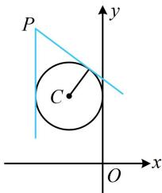

> [!faq]- 《第3节 圆的切线有关的计算》参考答案
>
> > [!success]- **【答案】** $x = -2$ 或 $3x + 4y - 10 = 0$
>
> > [!note]- **【分析】**
> > 本题未单列分析。
>
> > [!note]- **【解析】**
> > 解析：$x^{2} + y^{2} + 2x - 4y + m = 0\Rightarrow (x + 1)^{2} + (y - 2)^{2} =$
> >
> > $5 - m$ ，所以圆心为 $C(-1,2)$ ，半径 $r = \sqrt{5 - m}$
> >
> > 因为圆 $C$ 与 $y$ 轴相切，所以圆心到 $y$ 轴的距离 $1 = \sqrt{5 - m}$
> >
> > 解得： $m = 4$ ，故圆 $C:(x + 1)^{2} + (y - 2)^{2} = 1$
> >
> > 如图，点 $P$ 在圆外，求切线可设斜率，先考虑斜率不存在的情况，当 $l \perp x$ 轴时，其方程为 $x = -2$ ，圆心 $C$ 到 $l$ 的距离 $d = 1$
> >
> > 满足直线 $l$ 与圆相切；
> >
> > 当 $l$ 不与 $x$ 轴垂直时，可设其方程为 $y - 4 = k(x + 2)$
> >
> > 即 $kx - y + 2k + 4 = 0$ ①，
> >
> > 所以 $d = \frac{|-k - 2 + 2k + 4|}{\sqrt{k^2 + (-1)^2}} = \frac{|k + 2|}{\sqrt{k^2 + 1}}$
> >
> > l 与圆 C 相切 $\Rightarrow d = r \Rightarrow \frac{|k + 2|}{\sqrt{k^{2} + 1}} = 1$ ，解得： $k = -\frac{3}{4}$ ，
> >
> > 代入①整理得 l 的方程为 $3x + 4y - 10 = 0$ ;
> >
> > 综上所述，切线 $l$ 的方程为 $x = -2$ 或 $3x + 4y - 10 = 0$
> >
> > 
